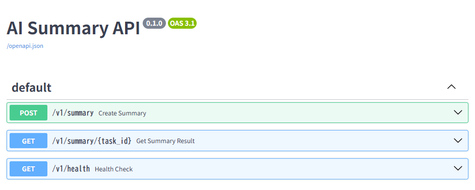
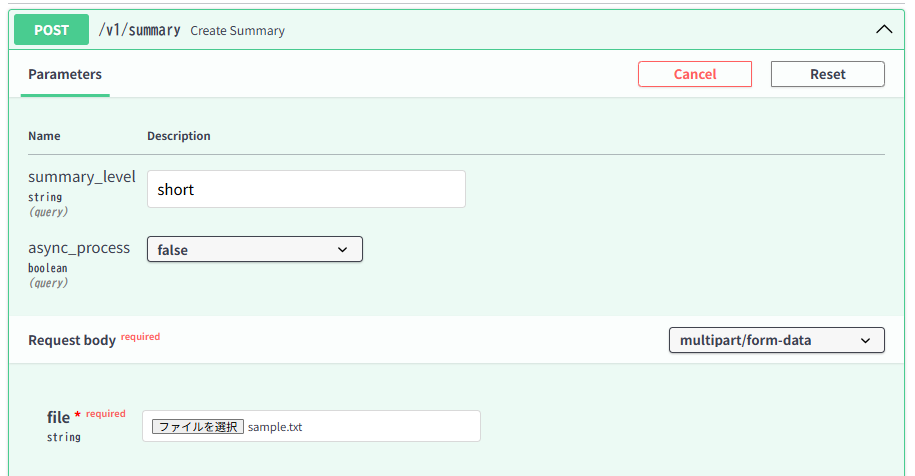
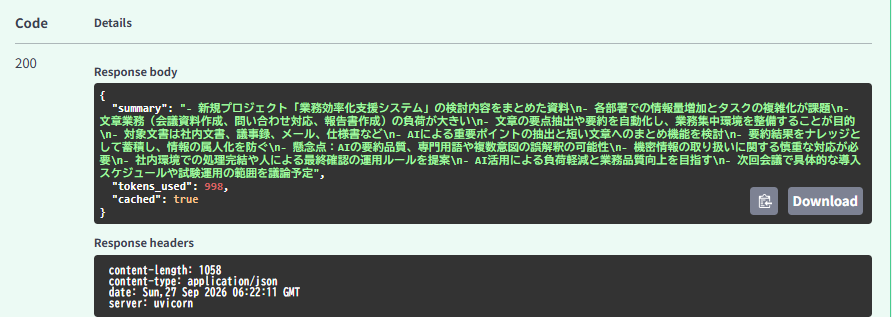
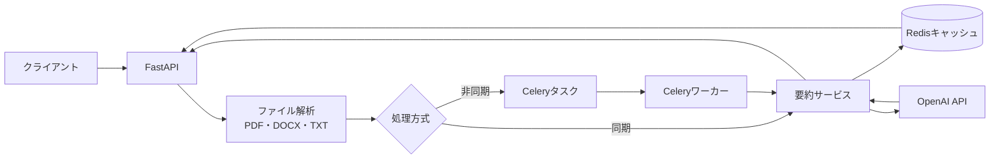
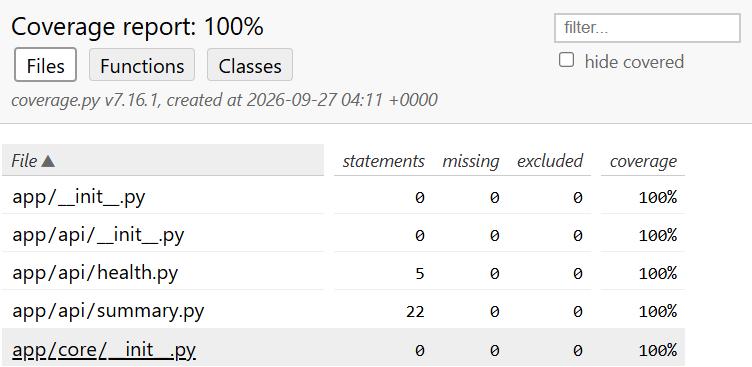

# LLMドキュメント要約API 

## 概要
PDF・DOCX・TXTファイルを受け取り、LLM（OpenAI `gpt-4o-mini`）で本文を要約するREST APIです。FastAPIによる同期処理と、Celeryによる非同期処理の両方に対応しています。

## スクリーンショット

### Swagger UI



### 要約リクエスト



### 要約結果



## 主な機能

- PDF、DOCX、TXTからのテキスト抽出
- `short`、`medium`、`long`の要約レベル指定
- OpenAI `gpt-4o-mini`による箇条書き要約
- 同期実行とCeleryワーカーによる非同期実行
- Redisを使った要約結果およびタスク結果の保存
- 文書内容と要約レベルに基づくキャッシュ
- ヘルスチェックエンドポイント

## 技術構成

- Python 3.11
- FastAPI / Uvicorn
- LLM: OpenAI `gpt-4o-mini`
- OpenAI Python SDK
- Celery
- Redis
- pypdf / python-docx
- Docker Compose / Poetry

## アーキテクチャ



## 起動方法

### 前提条件

- DockerとDocker Compose
- OpenAI APIキー

プロジェクトのルートに`.env`ファイルを作成し、次の値を設定します。

```dotenv
OPENAI_API_KEY=your-openai-api-key
REDIS_URL=redis://redis:6379/0
```

コンテナをビルドして起動します。

```bash
docker compose up --build
```

起動後、以下からAPI仕様とヘルスチェックを確認できます。

- Swagger UI: http://localhost:8000/docs
- Health check: http://localhost:8000/v1/health

## API

### 要約を同期実行

`POST /v1/summary`にファイルを送信します。  
`summary_level`は`short`、`medium`、`long`から指定できます。  
省略時は`short`です。

```bash
curl -X POST "http://localhost:8000/v1/summary?summary_level=short&async_process=false" \
  -F "file=@sample.txt"
```

成功時のレスポンス例:

```json
{
  "summary": "- 要約結果",
  "tokens_used": 123,
  "model": "gpt-4o-mini",
  "cached": false
}
```

### 要約を非同期実行

`async_process=true`を指定すると、受付時にタスクIDが返ります。

```bash
curl -X POST "http://localhost:8000/v1/summary?summary_level=medium&async_process=true" \
  -F "file=@sample.txt"
```

受付時のレスポンス例:

```json
{
  "task_id": "タスクID",
  "status": "processing"
}
```

タスクの完了結果は次のエンドポイントで取得します。

```bash
curl "http://localhost:8000/v1/summary/タスクID"
```

完了前、または該当する結果がない場合は`404`が返ります。

### ヘルスチェック

```bash
curl "http://localhost:8000/v1/health"
```

```json
{
  "status": "ok"
}
```

## キャッシュ

同期要約では、本文と要約レベルからSHA-256ベースのキャッシュキーを作成します。  
同じ本文・同じ要約レベルのリクエストは保存済みの要約を再利用します。  
キャッシュの有効期間は24時間です。

## テスト

ローカル環境で依存関係をインストールし、pytestを実行します。

```bash
poetry install
poetry run pytest
```

テストカバレッジは100%（ステートメントカバレッジ）を達成しています。



## プロジェクト構成

```text
app/
  api/        要約・ヘルスチェックAPI
  core/       設定・LLMクライアント
  services/   ファイル解析・要約ロジック
  utils/      Redisキャッシュ
  workers/    Celeryタスク
 tests/       API、サービス、ユーティリティのテスト
```

## 制約

- 1ファイルあたりのサイズ上限は5 MiBです。
- PDFから抽出できるのはテキスト情報です。画像のみのPDFに対するOCRには対応していません。
- 要約にはOpenAI APIを利用します。送信する文書の内容とAPI利用条件を確認してください。